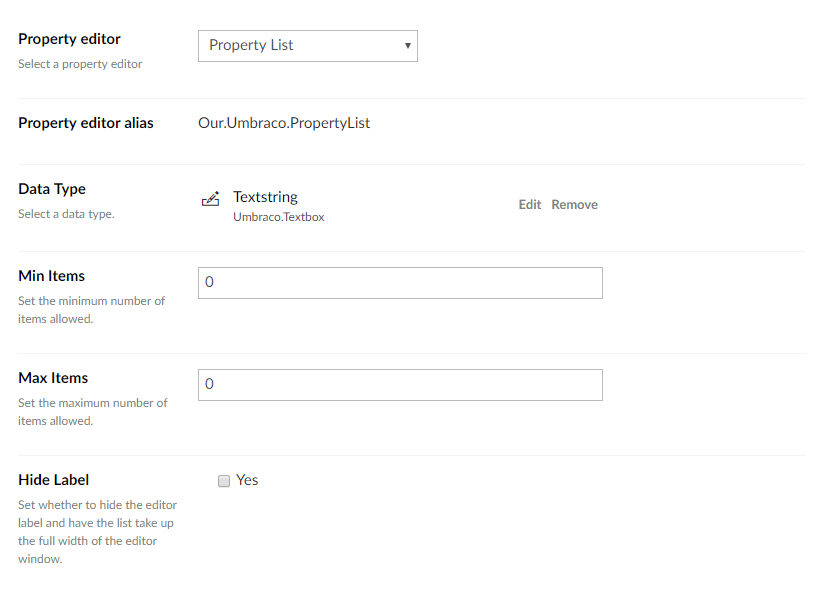
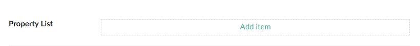

# Property List - Developers Guide

### Contents

1. [Introduction](#introduction)
2. [Getting Set Up](#getting-set-up)
3. [Configuring Property List](#configuring-property-list)
4. [Editing Property List](#editing-property-list)
5. [Rendering Property List](#rendering-property-list)
6. [Useful Links](#useful-links)

---

### Introduction

**Property List** is property editor for making repeatable lists for Umbraco 7.6+, similar to the default [**Multiple Textbox aka Repeatable textstrings**](https://our.umbraco.com/documentation/getting-started/backoffice/property-editors/built-in-property-editors/Multiple-Textbox) editor. However **Property List** has the ability to use any data-type to define the type of the list. By using data-types, we can use any property-editor to power the list, opening up to community property-editors, such as [**Styled Textbox**](https://our.umbraco.com/projects/backoffice-extensions/styled-textbox/).

---

### Getting Set Up

Before you get started, there are a number of things you will need:

1. Umbraco 7.6.0+
2. The **Property List** package installed

---

### Configuring Property List

The **Property List** property editor is set-up/configured in the same way as any standard property editor, via the *Data Types* admin interface. To set-up your Property List property, create a new *Data Type* and select **Property List** from the list of available property editors.

You should then be presented with the **Property List** property editors prevalue editor as shown below.



The prevalue editor allows you to configure the following properties.

| Member          | Type    | Description |
|-----------------|---------|-------------|
| Data Type       | Picker  | Select the data-type you wish to use for your **Property List**. By default, the **Textstring** will be pre-selected. |
| Min Items       | Integer | Sets the minimum number of items that should be allowed in the list. If greater than `0`, **Property List** will pre-populate your list with the minimum amount of allowed items and prevent deleting items below this level. Defaults to `0`.
| Max Items       | Integer | Sets the maximum number of items that should be allowed in the list. If greater than `0`, **Property List** will prevent new items being added to the list above this threshold. Defaults to `0`. |
| Hide Label      | Boolean | Enabling this will hide the property editors label and expand the **Property List** property editor to the full with of the editor window. |

Once your data-type has been configured, set-up a property on your page document-type using your new data-type and you are set to start editing.

---

### Editing Property List

When viewing a **Property List** editor for the first time, you'll be presented with a simple "Add item" button to get you started.



Clicking the "Add item" button will add a new item in the list.

To reorder the list, click and drag the move icon up and down to place the items in the order you want.


To remove an item from the list, click the trash can icon. If the minimum number of items is reached, then the trash can icon will disappear, this prevents going below the minimum allowed number of items.

---

### Rendering Property List

To render the stored value of your **Property List** property, a built-in value-converter is provided for you. By calling the `GetPropertyValue<T>` method with a generic type of `IEnumerable<string>` and the stored value will be returned as a list of `string` entity.

Please note, that the type of the `IEnumerable<T>` will depend on the data-type you have selected. The default **Textstring** will return a `string` object-type. If you select a different data-type, you will need to update the object-type (`T`) accordingly.

Example:

```csharp
@inherits Umbraco.Web.Mvc.UmbracoViewPage
@{
	var items = Model.GetPropertyValue<IEnumerable<string>>("myPropertyAlias");

	<ul>
		@foreach(var item in items)
		{
			<li>@item</li>
		}
	</ul>
}
```

If you are using Umbraco's ModelsBuilder feature, then the underlying object-type will automatically be wired up for you. You don't need to worry about this part.

---

### Useful Links

* [Source Code](https://github.com/umco/umbraco-property-list)
* [Our Umbraco Project Page](http://our.umbraco.org/projects/backoffice-extensions/property-list)
